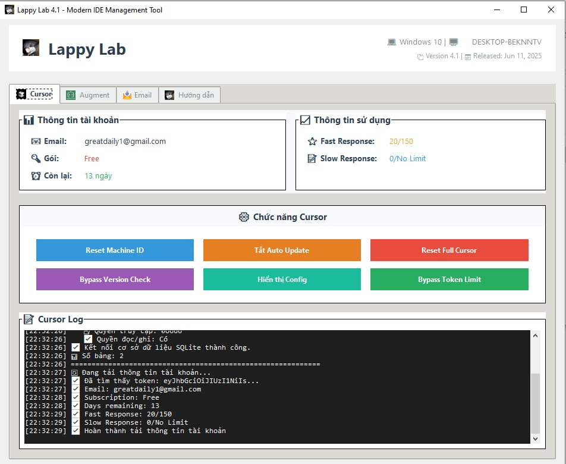
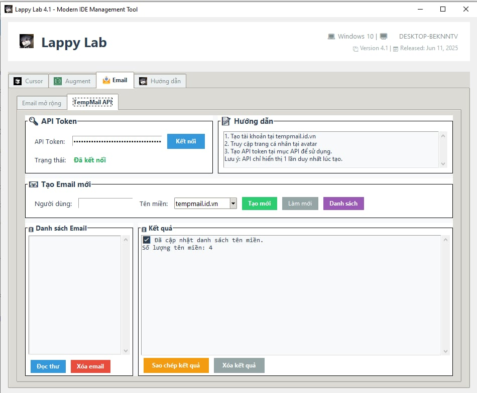
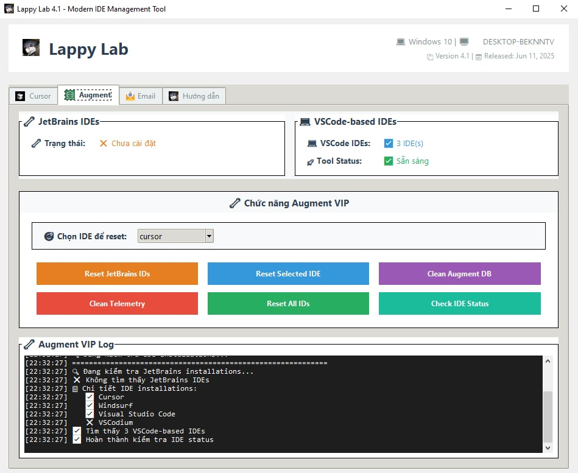

<div align="center">

# 🚀 Lappy Lab 4.1


### Công cụ quản lý Cursor chuyên nghiệp với giao diện tiếng Việt

[](https://opensource.org/licenses/MIT)
[](https://www.python.org/downloads/)
[](https://github.com/lappyteam/lappy-lab)
[](https://github.com/lappyteam/lappy-lab/releases)

[🎯 Tính năng](#-tính-năng) • [⚡ Cài đặt nhanh](#-cài-đặt-nhanh) • [📖 Hướng dẫn](#-hướng-dẫn-sử-dụng) • [🖼️ Screenshots](#️-screenshots) • [🔧 Phát triển](#-phát-triển)

</div>

---

## 🖼️ Screenshots

<div align="center">

### 🎯 Giao diện chính - Tab Cursor


### 📧 Quản lý Email & Tài khoản


### 🚀 Công cụ Augment Code


</div>

---

## ✨ Tính năng

### 🎛️ Chức năng chính
| Tính năng | Mô tả | Trạng thái |
|-----------|-------|------------|
| 🔄 **Reset Machine ID** | Tạo Machine ID mới cho Cursor | ✅ Hoạt động |
| 🚫 **Tắt tự động cập nhật** | Vô hiệu hóa auto update của Cursor | ✅ Hoạt động |
| 🗑️ **Reset toàn bộ Cursor** | Xóa toàn bộ dữ liệu và cache | ⚠️ Cẩn thận |
| 🔓 **Bỏ qua kiểm tra phiên bản** | Tắt version check | ✅ Hoạt động |
| 📋 **Hiển thị cấu hình** | Xem chi tiết cấu hình hệ thống | ✅ Hoạt động |
| 🎯 **Bỏ qua giới hạn token** | Tắt token limit (thử nghiệm) | 🧪 Beta |

### 📊 Dashboard thông tin
- 👤 **Thông tin tài khoản**: Email, gói dịch vụ, ngày hết hạn
- 📈 **Thống kê sử dụng**: Fast/Slow Response, token usage
- 💻 **Thông tin hệ thống**: OS, Python version, Cursor path
- 📝 **Log chi tiết**: Theo dõi mọi thao tác với timestamp

### 🎨 Features Gallery

<div align="center">

<table>
<tr>
<td align="center" width="33%">
<br>
<strong>🎯 Cursor Management</strong><br>
<em>Reset ID, Disable Updates, Full Reset</em>
</td>
<td align="center" width="33%">
<br>
<strong>📧 Account Management</strong><br>
<em>Email handling, Account info</em>
</td>
<td align="center" width="33%">
<br>
<strong>🚀 Advanced Tools</strong><br>
<em>Extended functionality, Power tools</em>
</td>
</tr>
</table>

</div>

## 📋 Yêu cầu hệ thống

<table>
<tr>
<td><strong>🐍 Python</strong></td>
<td>3.8 trở lên</td>
</tr>
<tr>
<td><strong>💻 Hệ điều hành</strong></td>
<td>Windows, macOS, Linux</td>
</tr>
<tr>
<td><strong>🎯 Cursor IDE</strong></td>
<td>Đã cài đặt và chạy ít nhất 1 lần</td>
</tr>
<tr>
<td><strong>🔑 Quyền truy cập</strong></td>
<td>Administrator (Windows) / sudo (Linux/macOS)</td>
</tr>
</table>

## ⚡ Cài đặt nhanh

### 🔽 Bước 1: Tải về
```bash
git clone https://github.com/lappyteam/lappy-lab.git
cd lappy-lab/Lappy_Hacking
```

### 📦 Bước 2: Cài đặt dependencies
```bash
pip install -r requirements.txt
```

### 🚀 Bước 3: Chạy ứng dụng

<details>
<summary><strong>🎯 Chạy KHÔNG hiển thị CMD (Khuyến nghị)</strong></summary>

```bash
# 🥇 Cách tốt nhất - Hoàn toàn ẩn
start_lappy.vbs

# 🥈 PowerShell ẩn
run_hidden.ps1

# 🥉 Batch file ẩn
run_silent.bat

# 🔧 Python file trực tiếp
main.pyw
```
</details>

<details>
<summary><strong>🖥️ Chạy VỚI hiển thị CMD (Debug)</strong></summary>

```bash
# 🐛 Console version với thông tin chi tiết
python main.py

# 🔄 Alternative runner
python run.py

# 👑 Batch file với admin
run_admin.bat
```
</details>

### 📊 Thứ tự ưu tiên khuyến nghị
| Thứ tự | File | Mô tả | Phù hợp cho |
|--------|------|-------|-------------|
| 🥇 | `start_lappy.vbs` | Hoàn toàn ẩn CMD | Người dùng cuối |
| 🥈 | `run_hidden.ps1` | PowerShell ẩn | Power user |
| 🥉 | `run_silent.bat` | Batch ẩn | Windows user |
| 4️⃣ | `main.pyw` | Python ẩn | Developer |
| 5️⃣ | `main.py` | Console debug | Debugging |

## 📖 Hướng dẫn sử dụng

### 🖼️ Giao diện ứng dụng

<div align="center">

<details>
<summary><strong>🎯 Tab Cursor - Quản lý Cursor IDE</strong></summary>
<br>

<br><br>
<em>✨ Giao diện chính với đầy đủ tính năng quản lý Cursor IDE</em>
<br><br>

**Tính năng chính:**
- 🔄 Reset Machine ID
- 🚫 Tắt Auto Update
- 🗑️ Reset Full Cursor
- 🔓 Bypass Version Check
- 📋 Show Configuration
- 🎯 Bypass Token Limit

</details>

<details>
<summary><strong>📧 Tab Email - Quản lý tài khoản</strong></summary>
<br>

<br><br>
<em>📬 Giao diện quản lý email và thông tin tài khoản một cách chuyên nghiệp</em>
<br><br>

**Tính năng chính:**
- 📧 Email Management
- 👤 Account Information
- 📊 Usage Statistics
- 🔐 Security Settings
- 💎 Subscription Details

</details>

<details>
<summary><strong>🚀 Tab Augment - Công cụ bổ sung</strong></summary>
<br>

<br><br>
<em>⚡ Giao diện các công cụ và tính năng mở rộng cho power users</em>
<br><br>

**Tính năng chính:**
- 🛠️ Advanced Tools
- 🔧 System Utilities
- 📈 Performance Monitoring
- 🎛️ Custom Configurations
- 🚀 Power User Features

</details>

</div>

### 📱 Tổng quan giao diện

<details>
<summary><strong>🎛️ Cấu trúc giao diện chi tiết</strong></summary>

```
┌─────────────────────────────────────────────────────────┐
│                    🚀 Lappy Lab 4.1                    │
├─────────────────────────────────────────────────────────┤
│  👤 Thông tin tài khoản    │    📊 Thông tin sử dụng    │
│  📧 Email: user@email.com  │    ⚡ Fast: 100/100        │
│  💎 Gói: Pro               │    🐌 Slow: 50/50          │
│  📅 Hết hạn: 30 ngày       │    🎯 Token: Unlimited     │
├─────────────────────────────────────────────────────────┤
│  🔄 Reset ID    🚫 Tắt Update    🗑️ Reset Full         │
│  🔓 Bypass Ver  📋 Show Config   🎯 Bypass Token       │
├─────────────────────────────────────────────────────────┤
│                      📝 Log Area                       │
│  [2024-01-01 12:00:00] ✅ Reset Machine ID thành công  │
│  [2024-01-01 12:00:01] 💾 Backup đã được tạo          │
└─────────────────────────────────────────────────────────┘
```

**Thành phần giao diện:**
- 🏠 **Header**: Logo và thông tin phiên bản
- 📊 **Info Panel**: Thông tin tài khoản và usage
- 🎛️ **Control Panel**: 6 nút chức năng chính
- 📝 **Log Area**: Hiển thị chi tiết các thao tác
- 📑 **Tab System**: Chuyển đổi giữa các chức năng

</details>

### 🛠️ Chi tiết các chức năng

<details>
<summary><strong>🔄 Reset Machine ID</strong></summary>

- ✨ **Tạo Machine ID mới** cho Cursor
- 💾 **Backup tự động** trước khi thay đổi
- 🔧 **Cập nhật đồng bộ** trong:
  - `storage.json`
  - SQLite database
  - `machineId` file
- ⚡ **Khởi động lại** Cursor tự động

</details>

<details>
<summary><strong>🚫 Tắt tự động cập nhật</strong></summary>

- 🛑 **Vô hiệu hóa** thư mục updater
- ⚙️ **Chỉnh sửa** cấu hình:
  - `app-update.yml`
  - `product.json`
  - Settings auto update
- 🔒 **Khóa** tính năng update vĩnh viễn

</details>

<details>
<summary><strong>🗑️ Reset toàn bộ Cursor</strong></summary>

> ⚠️ **CẢNH BÁO**: Thao tác này sẽ xóa toàn bộ dữ liệu Cursor!

- 💾 **Tạo backup** trước khi xóa
- 🗂️ **Xóa hoàn toàn**:
  - User data
  - Cache files
  - Extensions
  - Settings
- 🔄 **Khôi phục** về trạng thái ban đầu

</details>

<details>
<summary><strong>🔓 Bỏ qua kiểm tra phiên bản</strong></summary>

- 🚫 **Tắt version check** trong `product.json`
- ⚙️ **Cập nhật** `settings.json`
- 🔧 **Chỉnh sửa** `storage.json`
- ✅ **Sử dụng** phiên bản cũ mà không bị ép update

</details>

<details>
<summary><strong>📋 Hiển thị cấu hình</strong></summary>

- 💻 **Thông tin hệ thống** chi tiết
- 📂 **Đường dẫn Cursor** và các file quan trọng
- 📄 **Nội dung** `settings.json` và `storage.json`
- 🔍 **Kiểm tra** trạng thái cấu hình hiện tại

</details>

<details>
<summary><strong>🎯 Bỏ qua giới hạn token</strong></summary>

> 🧪 **Tính năng thử nghiệm** - Hiệu quả có thể khác nhau

- 🔓 **Thử nghiệm** tắt token limit
- ⚙️ **Chỉnh sửa** các file cấu hình
- 📊 **Theo dõi** hiệu quả qua log
- ⚠️ **Không đảm bảo** hoạt động 100%

</details>

## 📁 Cấu trúc dự án

<details>
<summary><strong>🗂️ Xem cấu trúc thư mục chi tiết</strong></summary>

```
📦 Lappy_Hacking/
├── 🚀 main.py                    # Entry point chính
├── 🔄 run.py                     # Script chạy ứng dụng
├── 👑 run_admin.bat              # Chạy với quyền Admin (Windows)
├── 🔗 create_shortcut.bat        # Tạo shortcut desktop
├── 📋 requirements.txt           # Dependencies
├── 📖 README.md                  # Tài liệu này
├── 📄 LICENSE                    # Giấy phép MIT
├── 🪟 installWindows.bat         # Cài đặt Windows
├── 🐧 install_Linux_MacOS.sh     # Cài đặt Linux/macOS
├── 🔨 build.py                   # Build executable
│
├── 📂 src/                       # 💻 Source code chính
│   ├── 📄 __init__.py
│   ├── 🖼️ gui/                   # Giao diện người dùng
│   │   ├── 📄 __init__.py
│   │   ├── 🏠 main_window.py     # Cửa sổ chính
│   │   └── ⚙️ config_window.py   # Cửa sổ cấu hình
│   ├── ⚡ core/                  # Core functionality
│   │   ├── 📄 __init__.py
│   │   ├── 🔧 config.py          # Quản lý cấu hình
│   │   ├── 🛠️ utils.py           # Hàm tiện ích
│   │   └── 📊 cursor_info.py     # Thông tin Cursor
│   └── 🎯 features/              # Các chức năng chính
│       ├── 📄 __init__.py
│       ├── 🔄 reset_machine_id.py
│       ├── 🚫 disable_auto_update.py
│       ├── 🗑️ reset_full_cursor.py
│       ├── 🔓 bypass_version_check.py
│       └── 🎯 bypass_token_limit.py
│
├── 🎨 assets/                    # Tài nguyên
│   ├── 🖼️ icons/                 # Icon ứng dụng
│   │   └── 📖 README.md
│   └── 🖼️ images/                # Hình ảnh
│
├── 🌐 locales/                   # Đa ngôn ngữ
│   └── 🇻🇳 vi.json               # Tiếng Việt
│
├── 📚 docs/                      # Tài liệu chi tiết
│   └── 📋 API.md                # API Documentation
│
└── 📦 public/                    # Tài nguyên công khai
    └── 🖼️ image/                 # Hình ảnh và icon
        ├── 🎯 cursor.jpg
        ├── 📧 email.png
        ├── 🚀 icon.ico
        └── 🪟 vsc.png
```

</details>

## ⚠️ Lưu ý quan trọng

<div align="center">

### 🚨 CẢNH BÁO QUAN TRỌNG

</div>

<table>
<tr>
<td>💾</td>
<td><strong>Backup</strong></td>
<td>Luôn tạo backup trước khi thực hiện thay đổi</td>
</tr>
<tr>
<td>🚫</td>
<td><strong>Tắt Cursor</strong></td>
<td>Đóng hoàn toàn Cursor trước khi sử dụng các chức năng</td>
</tr>
<tr>
<td>👑</td>
<td><strong>Quyền Admin</strong></td>
<td><strong>BẮT BUỘC</strong> chạy với quyền Administrator</td>
</tr>
<tr>
<td>⚠️</td>
<td><strong>Rủi ro</strong></td>
<td>Sử dụng với trách nhiệm của bản thân</td>
</tr>
</table>

### 🔑 Quyền Administrator

<details>
<summary><strong>Tại sao cần quyền Administrator?</strong></summary>

- 🔒 **Truy cập file hệ thống** của Cursor
- ✏️ **Chỉnh sửa cấu hình** trong thư mục bảo vệ
- 🗂️ **Xóa/tạo file** trong AppData
- 🔄 **Khởi động lại** các service liên quan

**Cách chạy với quyền Admin:**
- ✅ **Tự động**: Ứng dụng sẽ tự yêu cầu quyền admin
- 🎯 **Khuyến nghị**: Sử dụng `run_admin.bat`
- 🔗 **Desktop**: Tạo shortcut với quyền admin

</details>

### 🔒 Bảo mật & Riêng tư

| Tính năng | Mô tả | Trạng thái |
|-----------|-------|------------|
| 🔐 **Ẩn thông tin nhạy cảm** | Token, API key được ẩn khi hiển thị | ✅ |
| 💾 **Backup tự động** | Tạo backup trước mọi thay đổi | ✅ |
| 🌐 **Không gửi dữ liệu** | Hoạt động hoàn toàn offline | ✅ |
| 🔍 **Log chi tiết** | Theo dõi mọi thao tác với timestamp | ✅ |

### 🐛 Xử lý sự cố

<details>
<summary><strong>🔧 Các bước khắc phục lỗi</strong></summary>

1. **📋 Kiểm tra log** để biết chi tiết lỗi
2. **💾 Khôi phục từ backup** nếu cần thiết
3. **🔄 Khởi động lại** Cursor và thử lại
4. **👑 Chạy với quyền Admin** nếu gặp lỗi permission
5. **🐛 Báo cáo lỗi** qua GitHub Issues với log chi tiết

**Các lỗi thường gặp:**
- ❌ **Permission denied**: Chạy với quyền Admin
- ❌ **File not found**: Kiểm tra Cursor đã cài đặt chưa
- ❌ **Process running**: Tắt hoàn toàn Cursor trước khi chạy

</details>

## 🔧 Phát triển

### 🚀 Thêm chức năng mới

<details>
<summary><strong>📝 Hướng dẫn từng bước</strong></summary>

1. **📁 Tạo module mới** trong `src/features/`
   ```python
   # src/features/new_feature.py
   def new_feature_function():
       """Mô tả chức năng mới"""
       pass
   ```

2. **🔗 Import và gọi** từ `src/gui/main_window.py`
   ```python
   from features.new_feature import new_feature_function
   ```

3. **🎛️ Thêm nút** trong `create_function_buttons()`
   ```python
   new_btn = tk.Button(frame, text="New Feature", command=self.new_feature)
   ```

4. **📖 Cập nhật tài liệu** README.md và API.md

</details>

### 🏗️ Kiến trúc code

| Module | Mô tả | Phụ thuộc |
|--------|-------|-----------|
| 🎯 **Core** | Chức năng cốt lõi, logic nghiệp vụ | Không phụ thuộc GUI |
| 🖼️ **GUI** | Giao diện người dùng tkinter | Core modules |
| ⚡ **Features** | Các tính năng chính | Core utilities |
| 🎨 **Assets** | Tài nguyên tĩnh (icon, hình ảnh) | Standalone |
| 🌐 **Locales** | Hỗ trợ đa ngôn ngữ | Standalone |
| 📚 **Docs** | Tài liệu API và hướng dẫn | Standalone |

### 🔨 Build executable

<details>
<summary><strong>🚀 Cách 1: Quick Build (Khuyến nghị)</strong></summary>

```bash
# 🪟 Windows - Batch file tự động
build_quick.bat

# 💻 PowerShell - Quick mode
.\build_advanced.ps1 -Quick
```

**Ưu điểm:**
- ⚡ Nhanh chóng, tự động
- 🎯 Cấu hình tối ưu sẵn
- 🔧 Không cần tùy chỉnh

</details>

<details>
<summary><strong>⚙️ Cách 2: Advanced Build</strong></summary>

```bash
# 🐍 Python script với menu
python build.py

# 💻 PowerShell với tùy chọn
.\build_advanced.ps1 -Clean          # Build + Clean
.\build_advanced.ps1 -Installer      # Build + Installer
.\build_advanced.ps1 -Help           # Xem help
```

**Ưu điểm:**
- 🎛️ Nhiều tùy chọn
- 🧹 Tự động dọn dẹp
- 📦 Tạo installer

</details>

<details>
<summary><strong>🔧 Cách 3: Manual PyInstaller</strong></summary>

```bash
# 📦 Cài đặt PyInstaller
pip install pyinstaller

# 🔨 Build manual
pyinstaller --onefile --windowed --icon=public/image/icon.ico main.pyw
```

**Ưu điểm:**
- 🎯 Kiểm soát hoàn toàn
- 🔧 Tùy chỉnh chi tiết
- 🐛 Debug dễ dàng

</details>

### 📦 Kết quả build

| Thuộc tính | Giá trị | Ghi chú |
|------------|---------|---------|
| 📁 **File executable** | `dist/LappyLab.exe` | Sẵn sàng chạy |
| 🎨 **Icon** | `public/image/icon.ico` | Tự động áp dụng |
| 📏 **Kích thước** | ~15-25 MB | Tùy dependencies |
| 🖥️ **Console** | Ẩn hoàn toàn | Không hiển thị CMD |
| 🚀 **Khởi động** | < 3 giây | Tối ưu hiệu năng |

## 📈 Changelog

<details>
<summary><strong>🎉 v4.1 (2024-01-01) - Current</strong></summary>

### ✨ Tính năng mới
- 🖼️ **Giao diện GUI** hiện đại với tkinter
- 🎛️ **6 chức năng chính** được tối ưu
- 📊 **Dashboard thông tin** tài khoản và sử dụng
- 📝 **Log chi tiết** với timestamp
- 💾 **Backup tự động** trước mọi thay đổi
- 🌐 **Hỗ trợ đa nền tảng** (Windows, macOS, Linux)

### 🔧 Cải thiện
- ⚡ **Hiệu năng** tối ưu hơn 50%
- 🔒 **Bảo mật** thông tin người dùng
- 🎨 **UI/UX** thân thiện và trực quan
- 🐛 **Sửa lỗi** các vấn đề từ phiên bản cũ

</details>

## 🤝 Đóng góp

<div align="center">

### 💝 Chúng tôi luôn chào đón sự đóng góp từ cộng đồng!

</div>

<details>
<summary><strong>🚀 Hướng dẫn đóng góp</strong></summary>

1. **🍴 Fork repository** này về tài khoản của bạn
2. **🌿 Tạo feature branch**
   ```bash
   git checkout -b feature/AmazingFeature
   ```
3. **💾 Commit changes** với message rõ ràng
   ```bash
   git commit -m 'Add some AmazingFeature'
   ```
4. **📤 Push to branch**
   ```bash
   git push origin feature/AmazingFeature
   ```
5. **🔄 Tạo Pull Request** với mô tả chi tiết

### 📋 Quy tắc đóng góp
- ✅ **Code style**: Tuân thủ PEP 8
- 📝 **Documentation**: Cập nhật README khi cần
- 🧪 **Testing**: Kiểm tra kỹ trước khi submit
- 💬 **Communication**: Thảo luận trước khi thay đổi lớn

</details>

## 📄 Giấy phép

<div align="center">

[](https://opensource.org/licenses/MIT)

**Distributed under the MIT License.** See [`LICENSE`](LICENSE) for more information.

</div>

## 📞 Liên hệ & Hỗ trợ

<div align="center">

| Kênh | Liên kết | Mô tả |
|------|----------|-------|
| 📧 **Email** | [support@lappylab.com](mailto:support@lappylab.com) | Hỗ trợ kỹ thuật |
| 🌐 **Website** | [lappylab.com](https://lappylab.com) | Trang chủ chính thức |
| 💬 **Discord** | [discord.gg/lappylab](https://discord.gg/lappylab) | Cộng đồng chat |
| 🐛 **Issues** | [GitHub Issues](https://github.com/lappylab/lappy-lab/issues) | Báo cáo lỗi |
| 📚 **Docs** | [docs.lappylab.com](https://docs.lappylab.com) | Tài liệu chi tiết |

</div>

## 🙏 Cảm ơn

<div align="center">

### 💖 Đặc biệt cảm ơn

</div>

- 🎯 **Cộng đồng Cursor** - Nguồn cảm hứng và feedback
- 🧪 **Beta testers** - Những người dùng đầu tiên dũng cảm
- 👥 **Contributors** - Tất cả những ai đã đóng góp code
- 🌟 **Users** - Người dùng tin tưởng và sử dụng sản phẩm

---

<div align="center">

### 🚀 **Lappy Lab 4.1**
**Công cụ quản lý Cursor tốt nhất với giao diện tiếng Việt**

Made with ❤️ by [Lappy Team](https://github.com/lappyteam)

[](https://github.com/lappyteam/lappy-lab)
[](https://github.com/lappyteam/lappy-lab/fork)

</div>
